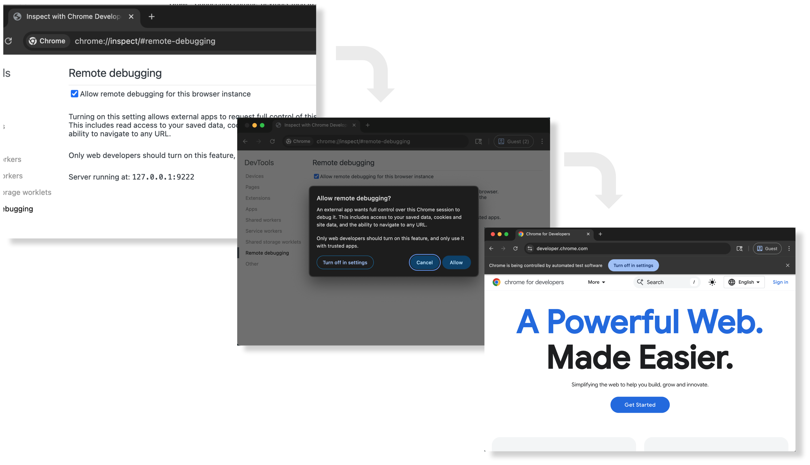

# Chrome Debug Auto Allow

macOS 常驻小工具：在 Chrome 弹出远程调试授权框，或显示「正受到自动测试软件的控制」横幅时，通过辅助功能识别文案与按钮并自动处理。与 `chrome-devtools-mcp`、Grok、Claude Code 等客户端解耦，只操作 Chrome UI。

> **安全提示：** 辅助功能可以读取并操作本机界面。允许 CDP 连接意味着能连上该调试会话的程序可以读取当前 profile 的登录态、执行页面脚本并导航。请先阅读[安全说明](#安全说明)，确认可接受风险后再启用。

## 它做什么

| 界面 | 行为 |
| --- | --- |
| 远程调试授权弹窗 | 文案同时命中远程调试关键词与确认语义，且找到精确的「允许 / Allow」等按钮时才点击 |
| 自动化控制横幅 | 命中已知 info bar 与横幅文案，且找到精确的「关闭 / Close」时才收起 |

不会替你开启远程调试，不会改 Chrome，不会转发 CDP，也不会管理 MCP。

## 适用范围

- macOS（Apple Silicon 与 Intel）
- Google Chrome、Chrome Canary、Chromium
- 日常 Profile，以及独立 `--userDataDir` / `--user-data-dir` 启动的额外 Chrome 进程
- Chrome 144+，且已在 `chrome://inspect/#remote-debugging` 手动开启远程调试（`--autoConnect` 场景）
- 安装需要 [Xcode Command Line Tools](https://developer.apple.com/download/all/) 中的 `swiftc`（不必安装完整 Xcode）；编译后的应用运行时无额外依赖

## 安装与授权

若尚未安装 Command Line Tools：

```sh
xcode-select --install
```

在仓库目录执行：

```sh
./scripts/install.sh
```

脚本会：

1. 用 `swiftc` 编译 `scripts/debug-auto-allow.swift`
2. 生成并 ad-hoc 签名 `~/Applications/Debug Auto Allow.app`
3. 安装并启动 LaunchAgent `com.local.debug-auto-allow`

然后到 **系统设置 → 隐私与安全性 → 辅助功能**：

1. 添加 `~/Applications/Debug Auto Allow.app`（可用 `⌘⇧G` 输入路径）
2. 打开开关
3. 确认服务在跑：

   ```sh
   launchctl print "gui/$(id -u)/com.local.debug-auto-allow"
   ```

重新编译后 macOS 常会要求重新授权：先从辅助功能列表移除旧条目，再添加新构建。日志里应出现 `ax-trusted=true`。

## 验证与日常使用

前台 dry-run（不点击，只打日志；结束时恢复原 LaunchAgent）：

```sh
./scripts/dry-run.sh
```

另开终端看日志：

```sh
tail -f /tmp/debug-auto-allow.debug.log
```

卸载服务但保留 `.app`：

```sh
./scripts/uninstall.sh
```

同时删除应用：

```sh
./scripts/uninstall.sh --remove-app
```

卸载不会清理辅助功能授权，不用时请自行在系统设置中移除。

## 配置

安装前可通过环境变量写入 LaunchAgent：

| 变量 | 默认 | 作用 |
| --- | --- | --- |
| `DEBUG_AUTO_ALLOW_DRY_RUN` | `0` | `1` = 只记录将要点击的目标，不点击 |
| `DEBUG_AUTO_ALLOW_FOCUS_STEAL` | `0` | `1` = 无焦点点击失败后才激活 Chrome 并重试 |
| `DEBUG_AUTO_ALLOW_INTERVAL` | `0.4` | 轮询间隔（秒），范围 0.2–5 |
| `DEBUG_AUTO_ALLOW_APP_PATH` | `~/Applications/Debug Auto Allow.app` | 自定义安装路径（须以该应用名结尾） |

```sh
DEBUG_AUTO_ALLOW_DRY_RUN=1 ./scripts/install.sh
DEBUG_AUTO_ALLOW_DRY_RUN=0 ./scripts/install.sh
```

## 自动处理的界面说明

Chrome 144+ 在远程调试连接时会弹出授权框；连接后还会显示自动化控制横幅。下图来自 Chrome 官方文档：



*图片来源：[Chrome for Developers：Let your Coding Agent debug your browser session with Chrome DevTools MCP](https://developer.chrome.com/blog/chrome-devtools-mcp-debug-your-browser-session)，CC BY 4.0。*

### 远程调试授权弹窗

- 文案须同时包含远程调试相关词（如 remote debugging / DevTools / 远程调试）与确认语义（如访问已保存数据、完全控制等）。
- 必须找到名称精确匹配的「Allow / 允许」等按钮。
- 若弹窗在未命名独立窗口中，还须同时存在精确的「Cancel / 取消」按钮。
- 网页 alert、扩展权限等不在处理范围。

### 自动化控制横幅

- 只处理 Chrome 系浏览器的 info bar（如「信息栏」）。
- 文案须命中已知句子，例如「Chrome 正受到自动测试软件的控制」或其英文 / 繁中等价文案。
- 只点「Close / 关闭」，不点「在设置中关闭」。
- 通过原生 Accessibility 按 PID 扫描，因此独立 Profile 窗口也会处理。

两类操作的最短间隔为 3 秒。

## 与 Grok / Chrome DevTools MCP

先安装并授权本工具，再在 Chrome 中手动开启远程调试。Grok 示例：

```toml
[mcp_servers.chrome-devtools]
command = "npx"
args = ["-y", "chrome-devtools-mcp@latest", "--autoConnect"]
```

MCP 直接连正在运行的 Chrome；不要用本工具包装 MCP 的 `command`。

更稳妥的做法是给 MCP 单独目录，避免动日常登录态：

```toml
[mcp_servers.chrome-devtools]
command = "npx"
args = ["-y", "chrome-devtools-mcp@latest", "--userDataDir=/Users/<你>/Library/Application Support/Chrome DevTools MCP"]
```

## 安全说明

自动允许远程调试等于把该 Chrome 会话的控制权交给本机可连上调试端口的程序。辅助功能权限本身也大于本工具的单一用途。

不建议对含网银、邮箱、密码管理器登录态的日常 Profile 长期无条件开启。优先使用独立 `--userDataDir`。

本工具不会：关闭 Chrome 安全机制、修改 Chrome 二进制、关闭 SIP、开放非 localhost 调试端口，或在文案不匹配时盲按键盘。

## 日志与排障

| 现象 | 处理 |
| --- | --- |
| 服务是否在跑 | `launchctl print "gui/$(id -u)/com.local.debug-auto-allow"` |
| 行为日志 | `/tmp/debug-auto-allow.debug.log` |
| `ax-trusted=false` | 重新添加并启用辅助功能中的 `Debug Auto Allow.app` |
| 弹窗/横幅没反应 | 确认 Chrome 版本与文案；检查 `scripts/debug-auto-allow.swift` 里的 `Matchers` |
| 独立 Profile 无效 | 确认跑的是当前构建；日志应能在多实例并存时仍出现 Dismissed / Clicked |
| `swiftc: command not found` | `xcode-select --install` |

## 开发自检

```sh
bash -n scripts/install.sh scripts/uninstall.sh scripts/dry-run.sh
plutil -lint launchd/com.local.debug-auto-allow.plist
swiftc -O -o /tmp/DebugAutoAllowCheck scripts/debug-auto-allow.swift \
  -framework AppKit -framework ApplicationServices
```

真实界面验证（日常 Profile 与独立新 Profile 两种场景）见 [AGENTS.md](AGENTS.md)。
